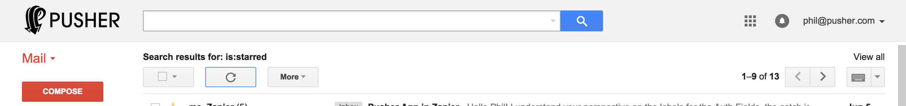
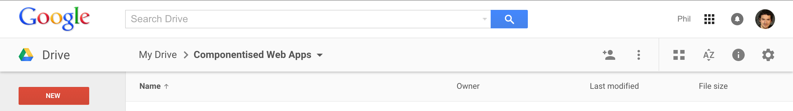

name: dblue
layout: true

class: bg-dark, center, middle

---

name: lblue
layout: true

class: bg-light, center, middle

---

class: title

# Tools, Tips & Tricks for building Componentised Web Apps

* <span class="speaker">Phil @leggetter</span>
* <span class="speaker-job-title">Head of Evangelism</span>
* <span class="speaker-pusher-logo"></span>

???

---

template: dblue
class: bg-contain, pusher-circle
background-image: url(./img/pusher-circles.png)

---

background-image: url(./img/caplin-trader-examples.png)
class: trans-h

# Caplin Systems

???

---

background-image: url(./img/caplin-trader.png)

???

---

template: dblue
class: bg-contain
background-image: url(./img/brjs-site.png)

???

---

template: dblue
class: bg-contain
background-image: url(./img/brjs-video-compilation.png)

???

* ~10 events
* Guessing how James found me
* STV TechTalks
* DunDDD
* QCon London
* Fluent
* FOSDEM
* FutureJS
* Devoxx
* FED London
* DevWeek

---

# Fundamentally about Building Componentised Web Apps

---

class: top

## What I'll Cover

* Questions & Ideas
* 5 Tools, Tips & Tricks

---

class: top

## What I'll Cover

* Questions & Ideas
* ~~5 Tools, Tips & Tricks~~
--

* 5 Lessons Learned
--

* Questions &#10095; Lessons Learned &#10095; Answers

---

background-image: url(./img/gifs/so-what-is-it.png)

# But, What are Components?

---

class: top

## What are Components?

--

* DOM Elements?
--

* Widgets

---

class: top

## What are Components?

* DOM Elements?
* ~~Widgets~~
--

* Application Modules?
--

* Application Features?
--

* Application Services?

---

class: bg-video, em-text, trans-h, top, vid-width-100

<video id="video" autoplay="true" loop="true">
	<source src="./img/pusher-debug-console.mp4" type="video/mp4">
</video>

???

* left-hand menu
* Central Console
	* Rows
	* Expandable rows
* Right-hand Event Creator

---

class: trans-h top
background-image: url(./img/gifs/shrug-carrey.gif)

# Component Best Practice?

---

background-image: url(./img/first.gif)
class: bg-contain, first-slide, trans-h, top

[addyosmani.com/first/](http://addyosmani.com/first/)

---

> Components Should Be Focused, Independent, Reusable, Small & Testable 

[Addy Osmani](https://twitter.com/addyosmani)

---

class: first-slide top

## Component Best Practice

* **F**ocused - How focused?
--

* **I**ndependent - without any external dependencies?
--

* **R**eusable - to what extent?
--

* **S**mall - It depends!
--

* **T**estable - &#10004;

---

class: trans-h bottom
background-image: url(./img/gifs/shrug-gosling.gif)

# Should all components be Web Components?

---

class: top

[Christian Heilmann: Web Components and You - Dangers to Avoid](http://christianheilmann.com/2014/04/18/web-components-and-you-dangers-to-avoid/)

> Just because we can make everything into an element now, doesn’t mean we should

--

## Why not?

---

## Questions

* What are components in your App architecture?
* What are the best practices for building components?
* Should all components be Web Components?

---

# 5 Lessons Learned

---

class: trans-h
background-image: url(./img/gifs/spanish-inquisition.jpeg)

# 1. Three<sup>*</sup> Application Component Types

<sup>* maybe 4</sup>

---

## i. Reusable Elements

Functionality reusable cross-application feature or even cross-application.

---

class: bg-contain
background-image: url(./img/app-component-types-reusable-elements.png)

---

class: bg-contain
background-image: url(./img/pdc-reusable-elements.png)

???

* Iconified menu items
* Probably not much else

---

class: img-max-width-100 long

Gmail


Google Drive


Google+


???

* Google clearly have cross-app reusable elements
* And they also want to standardise app elements in all Chrome/Android apps

---

class: bg-contain bg-white
background-image: url(./img/paper-elements.png)

---

## ii. Application Services

Access to shared resources, shared functionality and cross-feature communication.

---

class: bg-contain
background-image: url(./img/app-component-types-services.png)

---

class: bg-contain
background-image: url(./img/pdc-services.png)

---

## iii. Application Features

Standalone pieces of functionality.

???

Consisting of:

* feature specific logic
* built using some reusable Elements
* utilising services

---

class: bg-contain
background-image: url(./img/app-component-types-features.png)

---

class: bg-contain
background-image: url(./img/pdc-reusable-features.png)

---

class: bg-contain
background-image: url(./img/app-component-types-features.png)

---

class: bg-contain
background-image: url(./img/app-component-types-full.png)

???

Features can be composed of reusable elements

---

## iv. Bootstrapper<sup>*</sup>

Application glue. Brings features and services into your app.

???

I don't mean the bootstrap framework

---

class: bg-contain
background-image: url(./img/app-component-types-full.png)

---

class: bg-contain
background-image: url(./img/app-component-types-full-with-bootstrap.png)

---

class: trans-h
background-image: url(./img/gifs/isolation.jpg)

# 2. Develop Features in Isolation

---

background-image: url(./img/ct-noir.png)

---

background-image: url(./img/ct-noir-workbench-hidden-tools.png)

---

# Why?

---

class: trans-all bg-contain bg-white bottom
background-image: url(./img/group-assets-by-feature.png)

* Group assets by feature
* Easier to find feature assets
* Only load assets for a single feature
* Faster reload times

---

class: bg-contain trans-all bg-white
background-image: url(./img/broken-app.png)

* Unaffected by changes in other features

---

class: bg-contain trans-all bg-white bottom
background-image: url(./img/pdc-feature-service-mapping.png)

Only run services required by feature

---

## And...

* Improved developer experience
* Enforces loose coupling constraints (independent)

---

## How? Use Tooling

---

class: bg-contain, trans-h, bottom
background-image: url(./img/asset-graph.png)

## Asset Graph

??? Peter Müller

---

class: bg-contain bg-white
background-image: url(./img/what-is-webpack.png)

---

class: bg-contain bg-white
background-image: url(./img/system-js.png)

???

Guy Bedford

---

class: bg-contain bg-white
background-image: url(./img/pdc-console-logger-only.png)

---

class: top trans-all
background-image: url(./img/gifs/sharing.gif)

# 3. You Don't Always Have to Share

a.k.a. Avoid Premature Feature Abstraction

---

class: top

## Features &#10095; Reusable Elements?

--

> Some developers find it more feasible to build an integrated solution first and then extract out useful modules. This can save time on public interfaces that might turn out to be wrong

[addyosmani.com/first/](http://addyosmani.com/first/)

???

* I don't think this is just "some developers".
* I think this is a pragmatic best practice.
* If you share too soon changes become a maintenance nightmare

---

## Suggested Feature Abstraction Rules

* Keep code within App codebase initially (don't share)
* Only abstract after *at least* two clear use cases...
* ... and component API is stable
* Use specific/strict module versioning

---

background-image: url(./img/gifs/do-not-peek.gif)
class: trans-h bottom

# 4. Treat Services as Contracts/Interfaces

---

background-image: url(./img/ct-noir-workbench.png)
class: trans-h bottom

## Enables: "Develop Features in Isolation"

---

class: top bg-contain bg-white trans-all
background-image: url(./img/pdc-console-logger-only-fake-service.png)

Inject Fake Service into Services layer

---

## Makes Testing Easy

---

class: code-reveal top long

```js
var expect = require('expect.js');
var registry = require('ServiceRegistry');
```

--

```js
var FakeAwesomeService = require('FakeAwesomeService');
var FeatureToTest = require('feature');

var feature,
    service;
```

--

```js
describe('Feature#doStuff()', function(){
```

--

```js
  setup(function(){
    service = new FakeAwesomeService();
    registry.register('awesome', new FakeAwesomeService());
    feature = new FeatureToTest();
  });
```
		
--
		
```js
  it('should interact with the awesome service', function(){
    feature.doStuff();
    expect(service.hasBeenInteractedWith()).to.be(true);
  });

...
```

---

class: trans-all top
background-image: url(./img/gifs/stuck.gif)

# 5. Abstract the UI layer

Essential + longer-term options

---

## Essential: Use a UI library that abstracts the DOM

* Don't trust the DOM
* Consider using a View Model
* Makes testing more reliable

???

* React has a virtual DOM
* Knockout has a View Model
* Angular has a Scope

---

## Longer Term: Don't tie yourself to a UI library

* Enables change

---

class: bg-contain
background-image: url(./img/mvvm-knockoutjs.png)

---

class: bg-contain
background-image: url(./img/mvvm-angular.png)

---

class: bg-contain
background-image: url(./img/mvvm-react.png)

---

class: bg-contain
background-image: url(./img/mvvm-webcomponents.png)

---

# Bonus

## End to End Testability

???

Addy's initial version was FIRS and not FIRST

---

class: bg-contain trans-all
background-image: url(./img/vm-services-testing.png)

<h2 class="bottom-left">Test Entire Features in Isolation</h2>

---

class: bg-contain
background-image: url(./img/aligned-testing.png)

---

class: top trans-all
background-image: url(./img/gifs/wow.gif)

## Before: Selenium Tests

* On a suite of VMs = 8hrs

--

## After: Feature End to End Tests

* On a Single Machine < 30 minutes

---

# Questions Answered

---

class: top

## What are components in your App architecture?
--

* Reusable Components
* Application Features
* Application Services
--

* The Application itself (bootstrapper)?

---

class: bg-contain, top
background-image: url(./img/angular-2-my-app.png)

# Angular 2

---

class: top

## What are the best practices for building components?
--

* **F**ocused - reusable element, feature or service
--

* **I**ndependent - dev in isolation. Loose coupling of UI & Services
--

* **R**eusable - but only with care
--

* **S**ervices - access to shared functionality & resources
--

* **T**estable - because it's Isolated

---

class: top

## Should all components be Web Components?
--

* Provides a structure for building componentised web apps
--

* Reusable Elements & Features - yes
--

* Work within "best practice" constraints
--

* Services - ?
--

* The App - ?	

---

background-image: url(./img/gifs/columbo.gif)

---

## You're Already Building Componentised Web Apps

* Angular Directives
* Ember Components
* Knockout Components
* React Components

---

class: title

# Tools, Tips & Tricks for building Componentised Web Apps

Thanks, Feedback & Questions!

* <span class="speaker">Phil @leggetter</span>
* <span class="speaker-job-title">Head of Evangelism</span>
* <span class="speaker-pusher-logo"></span>
* pusher.com/jobs

???
